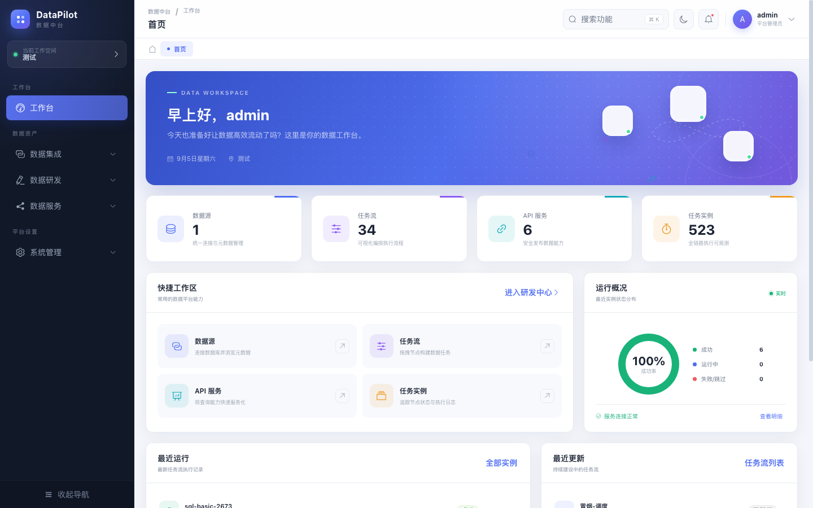
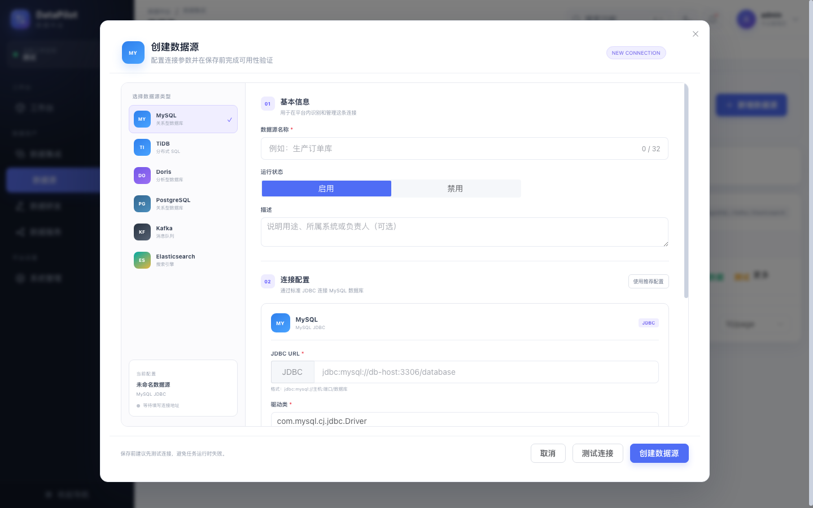
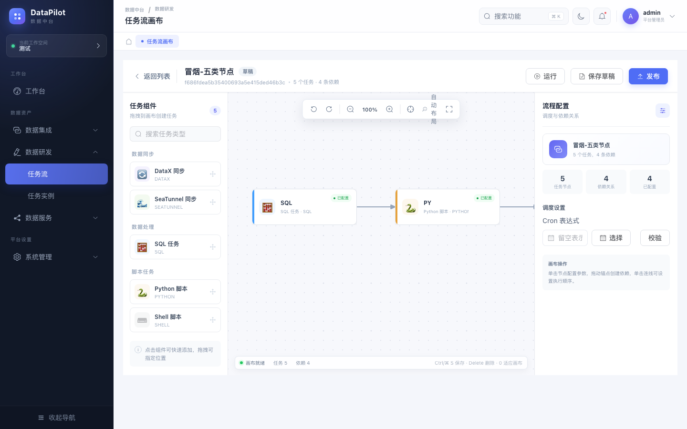
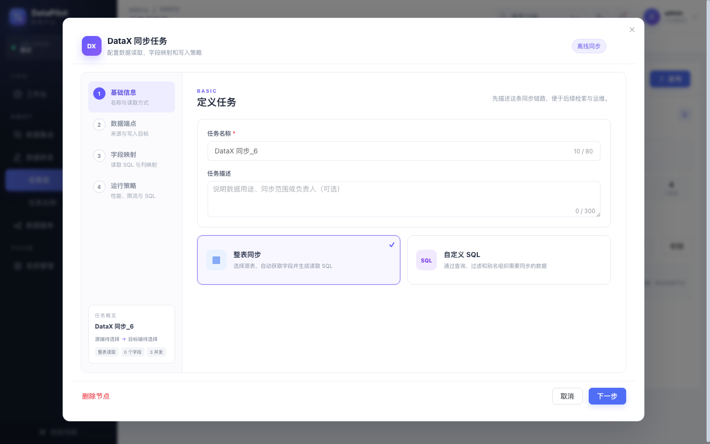
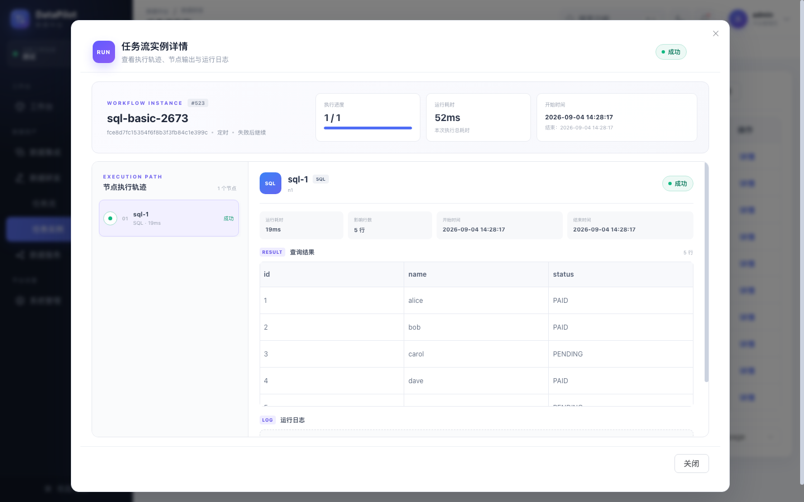
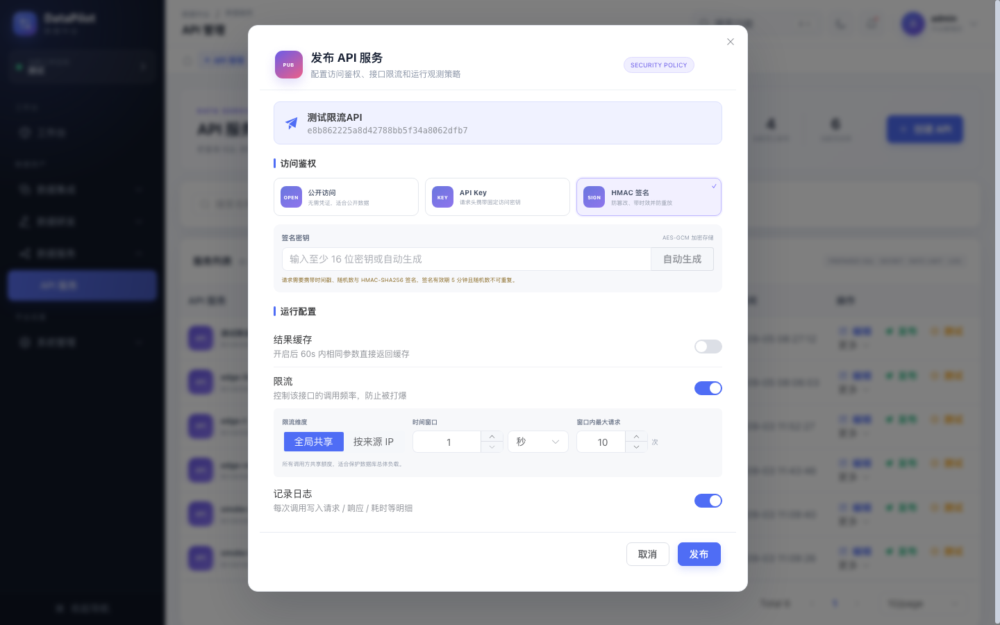

<div align="center">

# DataPilot

面向数据开发与数据服务场景的一体化数据平台

**可视化 DAG 编排 · DataX / SeaTunnel 数据集成 · SQL / Python / Shell 开发 · API 服务化**

</div>

DataPilot 在 `data-platform-open` 的基础上持续二次开发，提供从数据源接入、任务开发、工作流调度，到运行观测和 API 发布的一站式体验。当前版本重点重构了 Web UI 与交互流程，适合用于数据平台学习、二次开发和中小规模数据任务管理。



## 核心能力

| 模块 | 功能介绍 |
| --- | --- |
| 工作台 | 汇总数据源、任务流、API 服务和任务实例，展示运行成功率、最近任务与快捷入口。 |
| 数据源 | 统一管理 MySQL、TiDB、Doris、PostgreSQL、Kafka、Elasticsearch，支持连接测试、元数据浏览和密码加密。 |
| 数据集成 | 提供 DataX 四步配置向导和 SeaTunnel 同步节点，支持整表/自定义 SQL、字段映射、批次、并发和限速。 |
| 数据研发 | 在统一风格的 Monaco 编辑器中开发 SQL、Python、Shell 任务，支持参数、超时和运行配置。 |
| 任务流 | 基于 LogicFlow 的 DAG 画布，支持拖拽编排、依赖连线、自动布局、草稿/发布、手动运行和可视化 Cron。 |
| 运行观测 | 查看任务流实例、节点执行轨迹、耗时、影响行数、查询结果、错误信息和实时日志。 |
| API 服务 | 将只读 SQL 发布为 API，支持参数管理、在线测试、缓存、调用日志、版本隔离和 cURL 示例。 |
| 安全策略 | 支持公开访问、API Key、HMAC-SHA256；提供 AES-GCM 密钥保护、防重放及全局/来源 IP 限流。 |

## 功能截图

### 数据源接入

创建界面根据数据源类型切换连接参数，保存前可以测试连接；数据库密码不会在详情接口中明文回显。



### DAG 任务流编排

左侧选择 DataX、SeaTunnel、SQL、Python、Shell 节点，中间编排依赖关系，右侧配置调度策略。Cron 表达式通过可视化选项生成，减少手写错误。



### DataX 同步任务

DataX 使用四步向导组织任务定义、数据端点、字段映射和运行策略，并根据目标端能力处理 Insert、Replace、Update 与冲突键配置。



### 任务实例详情

实例详情集中呈现工作流状态、节点执行轨迹、查询结果和运行日志，便于定位任务失败与数据异常。



### API 发布与安全策略

查询模板可以发布为公开接口、API Key 接口或 HMAC-SHA256 签名接口，并按全局或来源 IP 设置 Redis 限流。



## API 安全设计

- API Key 使用 SHA-256 单向摘要保存，管理端不会返回原始密钥。
- HMAC 密钥使用带随机 IV 和认证标签的 AES-GCM 加密保存。
- HMAC 请求携带 `X-Timestamp`、`X-Nonce`、`X-Signature`，签名有效期为 5 分钟，并使用 Redis 防止 Nonce 重放。
- 限流支持所有调用方共享额度，或按来源 IP 独立计数；不同发布版本使用独立限流空间。
- SQL API 仅允许单条 `SELECT` / `WITH` 查询，模板参数使用预编译绑定。

HMAC 签名原文：

```text
timestamp + "\n" + nonce + "\n" + sha256(requestBody)
```

## 技术栈

- 前端：Vue 3、TypeScript、Element Plus、Pinia、LogicFlow、Monaco Editor、Vite
- 后端：Java 21、Spring Boot 3.4、MyBatis-Plus、Redisson、Fastjson2
- 基础设施：MySQL、Redis、RabbitMQ、Docker Compose
- 数据引擎：DataX、SeaTunnel

## 项目结构

```text
data-pilot/
├── backend/
│   ├── data-pilot-common/   # 公共组件、配置与基础能力
│   ├── data-pilot-flow/     # 任务流执行服务
│   ├── data-pilot-query/    # 查询服务
│   ├── data-pilot-support/  # 支撑服务
│   ├── data-pilot-web/      # Web API 主模块，默认端口 8080
│   └── docker/              # MySQL、Redis、RabbitMQ 及平台编排
├── frontend/                # Vue 3 管理端，默认端口 5173
└── docs/images/             # README 功能截图
```

## 本地运行

### 1. 准备依赖

本地需要 JDK 21、Maven、Node.js，以及 MySQL、Redis、RabbitMQ。数据库初始化脚本位于 `backend/docker/mysql/init.sql`，Docker 编排文件位于 `backend/docker/compose.yaml`。

### 2. 启动后端

```bash
cd backend

mvn -pl data-pilot-web -am -DskipTests -Dmaven.compiler.proc=full package

DB_URL='jdbc:mysql://localhost:3306/data_platform' \
DB_USERNAME=root \
DB_PASSWORD=your_mysql_password \
REDIS_HOST=localhost \
REDIS_PASSWORD=your_redis_password \
RABBITMQ_HOST=localhost \
java -jar data-pilot-web/target/data-pilot-web-1.0.jar
```

后端默认地址：`http://localhost:8080/dp-web`

### 3. 启动前端

```bash
cd frontend
npm install
npm run dev
```

前端默认地址：`http://localhost:5173`。初始化演示账号为 `admin / admin`，仅用于本地开发。

## 构建

```bash
# 后端
cd backend
mvn -pl data-pilot-web -am -DskipTests -Dmaven.compiler.proc=full package

# 前端
cd frontend
npm run build
```

## 生产安全说明

仓库中的 Docker 和开发配置包含便于本地启动的默认密码。生产部署前必须替换：

- `DP_PASSWORD_SECRET_KEY`、`DP_JWT_SECRET_KEY`
- MySQL、Redis、RabbitMQ 的账号和密码
- 初始化管理员密码与工作空间密钥

`DP_PASSWORD_SECRET_KEY` 用于保护数据源密码及 API HMAC 密钥。请在首次生产发布前设置高强度随机值并妥善备份，后续直接更换会导致已有密文无法解密。
